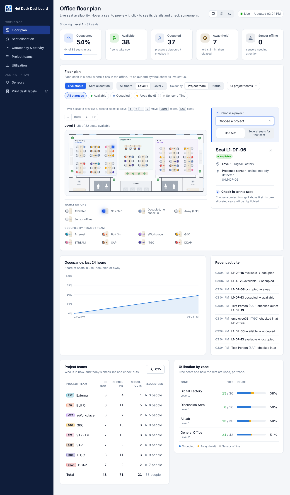

# Hot Desk Monitor

Monitors which desks in a building are taken, automatically frees desks when people stop using them,
and gives administrators a live dashboard of seat availability.

- **Detection:** under-desk presence sensors (primary) plus QR-code check-in (fallback / sensorless areas).
- **Auto-release:** a desk whose occupant has been gone longer than a grace period (default 20 min)
  becomes available again. Unconfirmed or expired check-ins are released too.
- **Admin dashboard:** live floor plan, KPIs, 24 h occupancy trend, per-zone utilisation, activity feed.



The current desk layout is in [docs/seat-layout.png](docs/seat-layout.png).

To run it on GitHub (Actions CI and Codespaces), follow [docs/GITHUB.md](docs/GITHUB.md).
To connect real desk sensors, follow [docs/SENSORS.md](docs/SENSORS.md).

The full proposal (sensor options, state rules, architecture, rollout) is in [docs/DESIGN.md](docs/DESIGN.md).

## Quick start

Requires Node.js 20.11 or newer. Run `npm install` once (one small dependency, used to draw the QR codes).

```bash
npm install
npm start                    # http://localhost:3000  (admin dashboard)
npm run simulate             # in a second terminal: fake sensors + check-ins
npm test
```

To watch seats auto-release quickly while simulating, shorten the grace:

```bash
AWAY_GRACE_MINUTES=1 npm start
```

The employee check-in page for a desk is `http://localhost:3000/checkin?seat=L1-A-01`. Encode that URL
in the QR sticker on each desk.

## Configuration

| Env var | Default | |
|---|---|---|
| `PORT` | 3000 | |
| `ADMIN_TOKEN` | *(unset → open)* | Required for the dashboard and admin API. The dashboard prompts for it |
| `SENSOR_API_KEY` | *(unset → open)* | Gateways send it as `X-Api-Key` |
| `AWAY_GRACE_MINUTES` | 20 | How long a desk is held after the person leaves |
| `CHECKIN_CONFIRM_MINUTES` | 15 | A check-in on a sensor desk must be confirmed by presence within this time |
| `CHECKIN_DURATION_MINUTES` | 180 | How long each check-in lasts by default (3 hours). Users can pick another length, and scanning again renews it |
| `CHECKIN_MAX_MINUTES` | 480 | Longest check-in a user can choose |
| `PUBLIC_URL` | *(address the page was opened at)* | Base URL encoded in the desk QR labels, e.g. `https://hotdesk.example.com` |
| `SENSOR_OFFLINE_MINUTES` | 15 | Silence after which a sensor counts as offline |
| `BUILDING_FILE` | `config/building.json` | Floors, zones and desk grid |
| `STATE_FILE` | `data/state.json` | Persisted state |

### Building layout

`config/building.json` holds the **DIC Annex @ Depot Road** layout, transcribed from
`CIO_DF_Seat_Assignment.pptx`. It has 125 desks:

| Floor | Zone | Desks | Notes |
|---|---|---|---|
| Level 1 | Digital Factory | 36 | 6 pods of 3×2 desks |
| Level 1 | Discussion Area | 16 | Former discussion area converted to desks (red outline in the deck): 4 single desks + 2 pods |
| Level 1 | AI Lab | 30 | 6 single desks along the stair wall + 2 pods of 6×2 |
| Level 2 | General Office | 43 | 5 pods in the top section (the last one single-sided) + 2 pods of 4×2 |

Each zone is an ASCII `map`, one string per row of desks: `.` is a desk and a space is no desk (an aisle or
the gap between pods). All desks are open hot desks. The coloured blocks in the deck are not used.

```json
"map": [
  ".. .. ..",
  ".. .. ..",
  "",
  ".. .. .."
]
```

Desk IDs are `<floor>-<zone>-<nn>`, numbered in reading order (left to right, top to bottom, e.g.
`L1-DF-01`). Sensor IDs are `S-<deskId>`. For QR-only areas, set `"sensors": false` on a zone or list
desk IDs in `"sensorless"`. A zone can also use plain `"rows"`/`"cols"` instead of a `map`.

Optionally, desks can be assigned to teams. Define `"teams": { "a": { "name": "...", "color": "#..." } }`
and use the team's letter in the map instead of `.`. When a layout has teams, the dashboard adds a
**Team assignment** view, a team filter and a utilisation-by-team table. Otherwise these are hidden.

The deck's blue arrows and "OSN" label are ignored. The latest revision of the deck blanks out the Level 2
UAT Stations block, so it is no longer part of the layout. Level 2 now has only the General Office.

## Check-in duration

Every check-in holds the desk for **3 hours by default**. On the check-in page the user can choose another
length, from 1 hour up to `CHECKIN_MAX_MINUTES` (8 hours). When the time is up the check-in expires and the
activity feed records it:

- On a desk **without a sensor**, the desk becomes available.
- On a desk **with a sensor**, the desk stays occupied while someone is still detected there. It is freed
  by the normal away grace once they leave.
- Scanning the desk's QR code again before the end extends the check-in by another 3 hours (or the chosen
  length) from that moment.
- A check-in on a sensor desk is still dropped after 15 minutes if nobody sits down, and checking out
  frees the desk immediately.

## Desk labels (QR codes)

Each desk gets a printable label with a QR code that opens its check-in page, plus the desk ID and location.
Labels are laid out for **A4 sheets of 21 labels (3 × 7, 63.5 × 38.1 mm, e.g. Avery L7160)**. Plain paper
works too (cut along the dashed guides shown on screen).

- **From the running app:** click **Print desk labels** on the dashboard, or open `/labels` (admin only).
  Filter with `/labels?floor=L1` or `/labels?floor=L1&zone=DF`. The QR codes use `PUBLIC_URL` if set,
  otherwise the address you opened the page at (in Codespaces that is the forwarded URL).
- **Without a server:** `PUBLIC_URL=https://hotdesk.example.com npm run labels` writes
  `labels/desk-labels.html`. Open it in a browser and print at 100% scale (no "fit to page").

Print the labels only once the app has its permanent address. The QR codes contain that address, so a
Codespaces URL on a sticker stops working when the Codespace is deleted.

## Connecting sensors

Sensors report through a LoRaWAN network server (The Things Stack or ChirpStack) or any system that can POST
JSON. Each sensor is then linked to its desk. **Step-by-step guide: [docs/SENSORS.md](docs/SENSORS.md).**

- **Webhooks:** `POST /api/integrations/ttn` and `POST /api/integrations/chirpstack` (TTN / ChirpStack v4
  uplinks). Generic: `POST /api/sensors/events` with `{"sensorId": "...", "presence": true}`. All of them
  need the `X-Api-Key` header.
- **Linking:** open **Sensors** on the dashboard (`/sensors`). Link sensors as they start reporting, paste
  IDs per desk, or bulk-link from a `desk,sensor` CSV. Alternatively, name each device in the network
  server after its desk (e.g. `s-l1-df-01`) and it links itself.
- **Before hardware arrives:** a desk with no sensor (or only its placeholder ID `S-<desk>`) works as a
  QR check-in desk.

## Project layout

```
src/occupancy.js   rules engine: seat states, auto-release, sensor links, summaries (pure, clock-injectable)
src/integrations.js TTN / ChirpStack uplink parsing
src/labels.js      printable QR desk labels
src/server.js      HTTP API, SSE stream, static pages
src/store.js       JSON persistence
src/index.js       wiring + periodic sweep
public/index.html  admin dashboard
public/checkin.html employee QR check-in page
public/sensors.html admin page for linking sensors to desks
scripts/simulate.js sensor/check-in simulator
docs/DESIGN.md     proposal & design
docs/SENSORS.md    connecting and linking sensors
docs/GITHUB.md     running on GitHub (CI, Codespaces)
```
